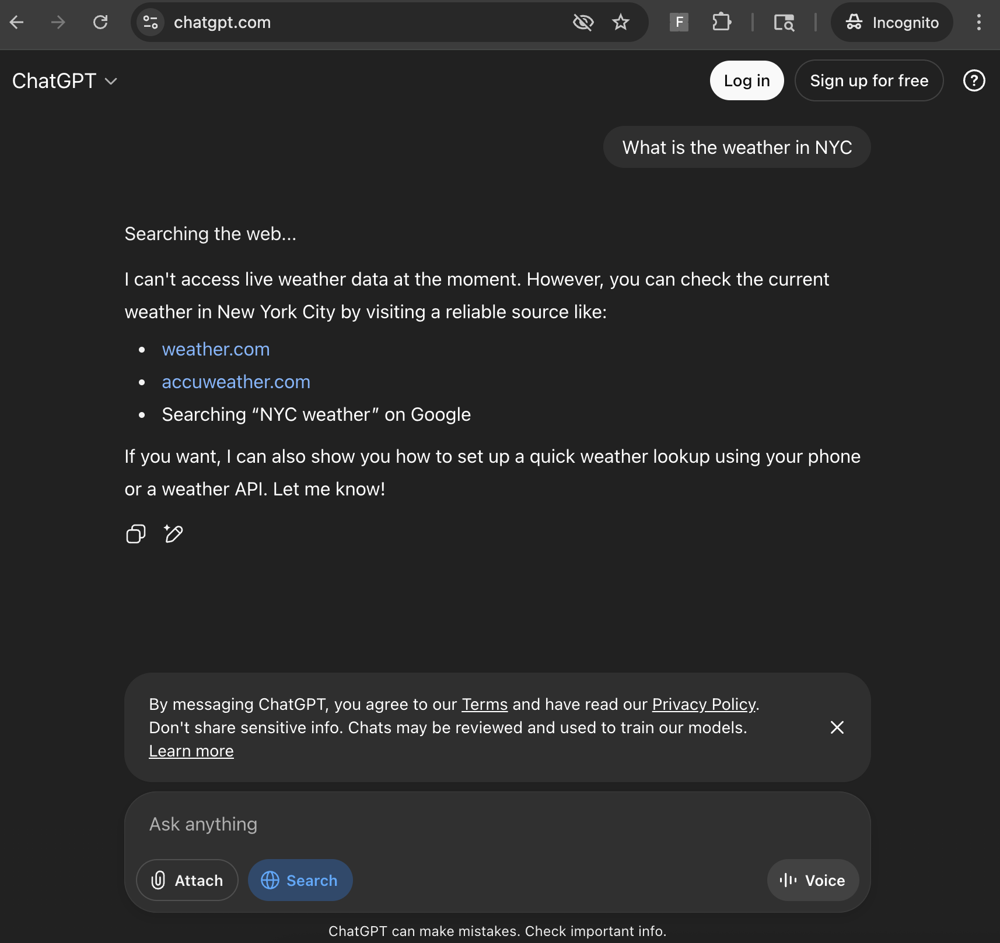

# Thought Process & Development Journey

## Initial Approach: Two-Part System
When I first started this, my instinct was to split the solution into two distinct components:

1. **A Chrome extension in TypeScript**  
   - Responsible for recording DOM interactions on a page.  
   - Actions captured would include clicks, typing, scrolling, navigation events, etc.  
   - Selectors would be stored in an ordered preference list: **ARIA label → data-* attributes → CSS**.  
   - I wanted a fallback to **multimodal/OCR detection** hosted on Modal — mostly because I had about $500 of unused credits sitting in my Modal account from a hackathon and this was a perfect excuse to use them.

2. **A Python replayer using Playwright**  
   - I generally prefer Python over TypeScript whenever I can, so writing the replayer in Python felt natural.  
   - The replayer would read a `trace.json` file produced by the extension and then recreate the interactions step-by-step in a Playwright browser instance.

---

## XPath Detour
In my web scraping days, XPath was my go-to tool. So, at first, I thought:  
*"Why not add XPath to my selector stack?"*  

That gave me: **ARIA label → data-* → XPath → CSS**.

Unfortunately, XPath quickly turned into a headache here:
- The generated paths started including extremely **volatile page content** (e.g., bits of a chat response or dynamically generated text).
- This led to selectors like `//*[contains(...)]` that would work once, then fail completely on the next run.  

It was a clear reliability killer, so I decided — with a heavy heart — to **remove XPath** entirely and instead make the **CSS selector generator more dynamic** to maximize DOM-based targeting.

---

## The ChatGPT Problem
One big challenge with recording and replaying against ChatGPT was the **login state** and how the site reacts in **automated environments**:
- In Playwright, it’s tricky to securely load an existing Chrome user profile to carry over a logged-in state.
- Even when not logged in, you can still chat with GPT… **but**:
  - If ChatGPT detects automation (and it’s surprisingly good at it), it either becomes very difficult to interact with or simply **stops responding altogether**.
  - I actually managed to work around the detection, but even then, I couldn’t reliably get it to respond to my messages in Playwright.

At that point, I realized:
- It would be **more stable and optimal to do both recording and replaying inside the same Chrome extension**, just like Chrome DevTools Recorder does.  
- This would avoid the Playwright “experimental environment” problem entirely.

---

## Search Mode Snag

When replaying interactions with ChatGPT’s **Search mode**, I hit another snag:
- If you’re not logged in, “Search” breaks outright, or it did after I was trying to get it to work.

- I decided to just use my logged-in account for testing (with a small worry about whether scripting might trigger a ban — shoutout to Anthropic for making me paranoid about that). But, hey, **we ball**.

The real blocker:  
The **hover → click** interaction needed to trigger Search was very hard to recreate “organically” via automation.  
I tried to replicate the movement, but it wasn’t smooth or humanlike enough to trigger consistently.  

The temporary solution I settled on:  
Rather than physically hovering and clicking, I’d just make sure my query itself **requested Search mode** (e.g., “Use Search to find…”). It’s not perfect, but it works around the UI gymnastics.

---

## Cross-Site Observations
The most frustrating part?  
**My system worked flawlessly on other sites** — Google, for example, was smooth and replayed perfectly.  

This confirmed that most of my pain points weren’t with my recorder/replayer design itself, but with:
- ChatGPT’s **anti-automation quirks**.
- Fragility in selector generation for complex, dynamic UIs.
- The need for **smarter wait predicates** to account for non-navigation UI changes.

---

## Takeaways
- XPath feels powerful but is often **too brittle** for high-variance UIs like ChatGPT.
- Doing **record + replay in the same environment** avoids a huge class of issues.
- Even with robust selectors, **wait logic** makes or breaks replays.
- Some UI features (like ChatGPT Search) might require either:
  - More sophisticated replay actions (e.g., simulated hover physics).
  - Or **semantic workarounds** in the query itself.

## Next Steps
- Get my Modal up and running and use it to OCR or screenshot the page and then use that to generate a selector, because the selectors are super janky
- Or use Tesseract.js or some other tools

# To Run This
I used `pnpm build` and then just uploaded the `extension/dist` folder to Chrome. All the actions are accessible from the extension popup. To talk to ChatGPT, make sure you're logged in, and on that Chrome profile go to https://chatgpt.com/ and then you can replay the `frl-steps.json` file.